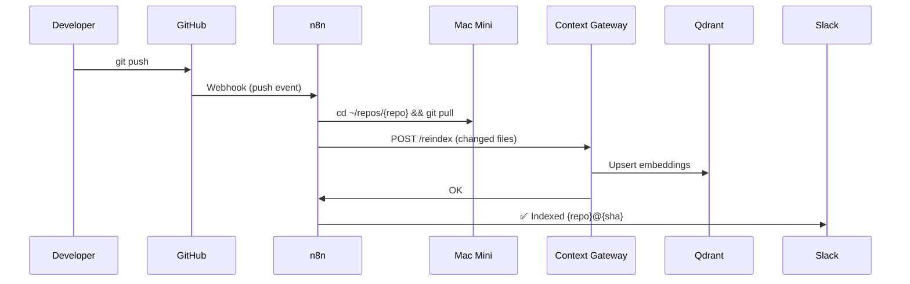

# Multi-Project Development Architecture

## Context-Aware, Memory-Persistent, Agent-Centric System

**Date:** 2025-10-30
**Status:** Design Discussion
**Owner:** lunar-snake

---

## Executive Summary

This document captures the architectural discussion and design for a multi-project development environment optimized for AI agent collaboration. The system addresses three core pain points:

1. **Duplication hell** - NUKE builds, agent rules, pre-commit hooks duplicated across repos
2. **Context burn** - Monorepo approaches consume tokens too quickly
3. **Agent amnesia** - No persistent memory across sessions or projects

### Key Architectural Decisions

- **Central Hub + Satellite Model** - One central repo for all shared assets, satellite repos stay code-only
- **Runtime Sync, Not Source Control** - Satellites pull shared assets at dev/CI time but don't commit them
- **Mac Mini as Infrastructure Brain** - Dedicated hardware running context services, memory, and orchestration
- **Phased Implementation** - Start with memory + deduplication, add RAG only if needed

---

## Table of Contents

1. [Current State & Pain Points](#current-state--pain-points)
2. [Architecture Overview](#architecture-overview)
3. [Central Hub Design](#central-hub-design)
4. [Satellite Repo Design](#satellite-repo-design)
5. [Infrastructure Components](#infrastructure-components)
6. [Syncing Strategy](#syncing-strategy)
7. [Phased Implementation](#phased-implementation)
8. [Technical Stack](#technical-stack)
9. [Naming Conventions](#naming-conventions)
10. [Decision Log](#decision-log)
11. [Next Steps](#next-steps)

---

## Current State & Pain Points

### Project Landscape

**Location:** `C:\lunar-snake\personal-work\`

```
├── infra-projects/    # .NET infrastructure projects
├── plate-projects/    # .NET plate projects
└── yokan-projects/    # .NET yokan projects (Unity included)
```

**Team:** Solo developer
**Scale:** Multiple .NET projects with NUKE builds
**Tooling:** Cline, Roo Code, Kilo (BYOK agents)

### Pain Points (Prioritized)

#### 1. Duplication Hell (Immediate)

- NUKE build scripts duplicated across every repo
- Agent rules (`.agent/` folders) copied manually
- Pre-commit hooks duplicated
- **Worse:** Each agent writes them differently, causing drift

**Example:**

```
infra-projects/project-a/nuke/Build.cs
infra-projects/project-b/nuke/Build.cs  # Similar but different!
plate-projects/project-c/nuke/Build.cs  # Agent wrote it differently!
```

#### 2. Context Burn (Immediate)

- Monorepo approach consumes tokens too fast
- Agents load entire codebase even for small changes
- GLM-4.6 has 200K token window but still burns through it

#### 3. Agent Amnesia (Immediate)

- No memory across IDE sessions
- Decisions/rationale lost when switching projects
- Agents re-ask the same questions
- Architecture choices not remembered

#### 4. Agent Disobedience (Moderate)

- Agent rules exist but aren't consistently followed
- No enforcement mechanism
- Rules scattered across repos

### Previous Approaches Tried

**Multi-repo (current):**

- ✅ Clean separation
- ❌ Massive duplication
- ❌ Agents confused by multiple repos
- ❌ Wrong docs/paths frequently

**Monorepo:**

- ✅ Single source of truth
- ❌ Context burns too quickly
- ❌ Agents load everything even for small changes

**Multi-repo with Git Submodules:**

- ❌ Hard to maintain
- ❌ Duplication still exists
- ❌ Submodule complexity

---

## Architecture Overview

### Mental Model

```
┌─────────────────────────────────────────────────────────────────┐
│                    Development Machine (Windows)                 │
│                                                                   │
│  ┌──────────────────────────────────────────────────────────┐   │
│  │  IDE (VS Code) + AI Agents (Cline/Roo/Kilo)             │   │
│  │  - Chat/Plans/Edits                                      │   │
│  │  - MCP Clients                                           │   │
│  └────────────┬─────────────────────────────────┬───────────┘   │
│               │                                 │               │
│               │ (1) HTTP MCP Tool               │ (2) FS MCP    │
│               │     (to Mac Mini)               │     (local)   │
│               │                                 │               │
│  ┌────────────▼─────────────────────────────────▼───────────┐   │
│  │  Satellite Repo (Code Only)                              │   │
│  │  - src/                                                  │   │
│  │  - .hub-manifest.toml  (pins versions)                   │   │
│  │  - .gitignore          (ignores synced assets)           │   │
│  └──────────────────────────────────────────────────────────┘   │
│               │                                                  │
│               │ git push                                         │
└───────────────┼──────────────────────────────────────────────────┘
                │
                │ GitHub
                │
                ▼
┌─────────────────────────────────────────────────────────────────┐
│              Infrastructure (Mac Mini - Always On)               │
│                                                                   │
│  ┌──────────────────────────────────────────────────────────┐   │
│  │  Context API Gateway (HTTP Service)                      │   │
│  │  - POST /ask     → RAG (context retrieval)               │   │
│  │  - POST /memory  → Persistent agent memory               │   │
│  │  - POST /notes   → Project notes/decisions               │   │
│  │  - POST /sync    → Index updates (optional)              │   │
│  │  - POST /reindex → Full rebuild (GitHub Actions)         │   │
│  └───────┬──────────────────────────────────┬────────────────┘   │
│          │                                  │                    │
│  ┌───────▼──────────┐              ┌────────▼──────────┐         │
│  │  LangChain RAG   │              │  Letta Agent Hub  │         │
│  │  - Embeddings    │              │  - Memory/State   │         │
│  │  - Qdrant DB     │              │  - SQL/SQLite     │         │
│  │  - Repo Index    │              │  - .af checkpoints│         │
│  └──────────────────┘              └───────────────────┘         │
│          │                                  │                    │
│  ┌───────▼──────────────────────────────────▼──────────┐         │
│  │  Local Git Clones (Read-Only Mirrors)               │         │
│  │  ~/repos/infra-projects/project-a/                  │         │
│  │  ~/repos/plate-projects/project-b/                  │         │
│  │  ~/repos/central-hub/                               │         │
│  └──────────────────────────────────────────────────────┘         │
│                                                                   │
│  ┌──────────────────────────────────────────────────────────┐   │
│  │  Orchestration (n8n or GitHub Actions)                   │   │
│  │  - git pull on webhook/schedule                          │   │
│  │  - Trigger /reindex                                      │   │
│  │  - Open PRs for version bumps                            │   │
│  └──────────────────────────────────────────────────────────┘   │
│                                                                   │
│          All services share one GLM-4.6 BYOK endpoint            │
└───────────────────────────────────────────────────────────────────┘
```

### Data Flow Examples

#### A. "Implement feature X in module Y"

1. **Windows IDE:** Developer asks Cline: "Implement inventory tracking"
2. **Agent → Gateway:** `POST /ask` with query + hints (`src/inventory`, `docs/rfcs`)
3. **Gateway → RAG:** Retrieves relevant code chunks from Qdrant (top-K only)
4. **Gateway → Agent:** Returns concise context bundle + file citations
5. **Agent:** Proposes plan using targeted context (not entire repo)
6. **Agent → Filesystem MCP:** Edits code locally (scoped to workspace)
7. **Agent → Gateway:** `POST /notes` - saves decision rationale
8. **Developer:** Reviews, commits, pushes
9. **Mac Mini n8n:** Detects push → `git pull` → triggers `/reindex`

**Result:** Memory persists, context was minimal, no token burn.

#### B. "Why did we choose Strategy B last week?"

1. **Windows IDE:** Developer asks: "Why Strategy B?"
2. **Agent → Gateway:** `POST /memory` with key `project/decisions/strategy`
3. **Gateway → Letta:** Retrieves stored decision + ADR link
4. **Agent:** Returns answer immediately (no RAG needed)

**Result:** Instant recall, no re-analysis.

#### C. "Use the NUKE build template"

1. **Developer:** Starts new project
2. **Satellite repo:** Contains `.hub-manifest.toml` pinning central hub version
3. **Bootstrap script:** Runs `tools/sync-hub.sh` → fetches agent rules, NUKE templates
4. **Agent:** Reads from `.hub-cache/nuke/` (gitignored, synced at runtime)
5. **Agent:** Applies template from single source of truth

**Result:** Zero duplication, always consistent.

---

## Central Hub Design

### Purpose

Single source of truth for:

- Specifications (RFCs, ADRs)
- Agent rules and prompts
- Reusable build components (NUKE)
- Pre-commit hooks and linters
- Infrastructure templates
- Reusable GitHub workflows

### Proposed Names (Alternatives to "platform-orchestrator")

| Name | Meaning | Pros | Cons |
|------|---------|------|------|
| `lunar-hub` | Your namespace + central hub | Personal, clean | Generic |
| `dev-nexus` | Development nexus/center | Clear purpose | Buzzwordy |
| `base-camp` | Foundation for all projects | Intuitive | Informal |
| `core-platform` | Core platform assets | Professional | Still says "platform" |
| `project-brain` | Brain for all projects | Memorable | Informal |
| `lunar-core` | Your namespace + core | Clean, professional | Could mean "main project" |
| `shared-foundation` | Shared foundation | Descriptive | Long |
| `dev-foundation` | Development foundation | Clear | Generic |

**Recommendation:** `lunar-hub` or `dev-nexus`

### Folder Structure

```
lunar-hub/  (or chosen name)
├── VERSION                         # Semantic version for consumers
├── README.md
├── docs/
│   ├── index.md
│   ├── how-to-consume.md
│   ├── how-to-upgrade.md
│   └── changelog.md
│
├── specs/                          # Specifications & Documentation
│   ├── auth-api/
│   │   ├── v1.0/
│   │   │   ├── rfc.md             # Request for Comments
│   │   │   ├── adr.md             # Architecture Decision Record
│   │   │   ├── schema/            # OpenAPI, JSON Schema, Protobuf
│   │   │   ├── contract-tests/    # Enforcement tests (dotnet/js)
│   │   │   └── agent-pack/        # Associated agent rules
│   │   └── v1.1/
│   └── inventory-system/
│       └── v1.0/
│
├── agents/                         # Agent Rules & Prompts
│   ├── rules/
│   │   ├── R-CODE-010-naming.md   # Naming conventions
│   │   ├── R-CODE-020-structure.md
│   │   ├── R-DOC-030-comments.md
│   │   ├── R-NUKE-001-builds.md
│   │   └── R-PRC-020-pr-format.md
│   ├── prompts/
│   │   ├── nuke-build-template.md
│   │   ├── feature-implementation.md
│   │   └── refactoring-guide.md
│   └── adapters/
│       ├── cline.md               # Cline-specific config
│       ├── roo-code.md
│       └── kilo.md
│
├── nuke/                           # NUKE Build Components
│   ├── README.md
│   ├── Build.Common.cs            # Common targets
│   ├── Build.DotNet.cs            # .NET-specific
│   ├── Build.Unity.cs             # Unity-specific
│   ├── Build.Docker.cs
│   └── templates/
│       ├── Build.Template.cs      # Starter template
│       └── Directory.Build.props
│
├── precommit/                      # Pre-commit Hooks
│   ├── .pre-commit-config.base.yaml
│   └── hooks/
│       ├── check_rfc_frontmatter.py
│       ├── check_nuke_consistency.py
│       ├── validate_agent_rules.py
│       └── dotnet_format.sh
│
├── linters/                        # Code Style Configs
│   ├── .editorconfig
│   ├── stylecop.json
│   ├── ruff.toml
│   ├── eslint.config.js
│   └── yamllint.yml
│
├── infra/                          # Infrastructure Templates
│   ├── docker/
│   │   ├── dotnet-runner/
│   │   │   ├── Dockerfile
│   │   │   └── entrypoint.sh
│   │   └── unity-runner/
│   ├── terraform/
│   │   ├── github-runners/
│   │   └── gcp-build/
│   └── k8s/
│
├── .github/
│   ├── workflows/                  # Reusable Workflows
│   │   ├── dotnet-ci.yml          # Callable via workflow_call
│   │   ├── unity-build.yml
│   │   ├── spec-contract-ci.yml
│   │   ├── precommit-check.yml
│   │   └── hub-sync.yml           # Self-hosted runner sync
│   └── ISSUE_TEMPLATE/
│
├── scripts/                        # Automation Scripts
│   ├── sync-to-satellite.sh       # Sync assets to satellite repos
│   ├── open-pr-upgrade.ts         # Open version bump PRs
│   ├── verify-satellite.sh        # Verify satellite wiring
│   └── publish-packs.sh           # Build/release artifact packs
│
├── packages/                       # Versioned Release Packs
│   ├── nuke-pack/
│   └── precommit-pack/
│
├── templates/                      # Boilerplate Files
│   ├── CODEOWNERS
│   ├── LICENSE_MIT
│   ├── .gitignore.base
│   └── PULL_REQUEST_TEMPLATE.md
│
└── registry/                       # Metadata Indices
    ├── specs.toml                 # Available specs + versions
    ├── packs.toml                 # Available packs + semver
    └── satellites.json            # Registered satellite repos
```

### Versioning Strategy

**Semantic Versioning per Asset Type:**

```toml
# registry/packs.toml
[nuke]
version = "2.1.0"
tag = "packs-nuke-v2.1.0"

[precommit]
version = "2.3.0"
tag = "packs-precommit-v2.3.0"

# registry/specs.toml
[auth-api]
latest = "1.2.0"
tags = ["spec-auth-api-v1.2.0", "spec-auth-api-v1.1.0"]

[inventory-system]
latest = "0.7.1"
tags = ["spec-inventory-system-v0.7.1"]
```

**Release Process:**

1. Make changes in hub repo
2. Bump version in appropriate `registry/*.toml`
3. Tag: `git tag packs-nuke-v2.1.0` (or spec tag)
4. Push tag: triggers GitHub Actions to build release artifacts
5. Automation opens PRs in satellites to bump versions

---

## Satellite Repo Design

### Purpose

**Pure code repositories** that consume shared assets from the central hub.

### Core Principle

**"Clean on GitHub, Rich at Runtime"**

- **Committed:** Code + `.hub-manifest.toml` only
- **Cached:** Everything else (agents, NUKE, specs) synced at runtime
- **Never Committed:** `.hub-cache/`, `.agents/`, synced builds

### Folder Structure

```
satellite-repo/  (e.g., infra-projects/auth-service)
├── src/                            # Your code (the ONLY thing you write)
│   ├── AuthService/
│   ├── AuthService.Tests/
│   └── AuthService.sln
│
├── .hub-manifest.toml              # **ONLY CONFIG FILE COMMITTED**
├── tools/
│   ├── bootstrap-hub.sh            # Fetch packs from hub (committed)
│   └── bootstrap-hub.ps1
│
├── .github/
│   └── workflows/
│       └── ci.yml                  # References hub workflows (committed)
│
├── .pre-commit-config.yaml         # References remote hub (committed)
├── .gitignore                      # Ignores .hub-cache/ (committed)
└── README.md

# Runtime-only (gitignored, synced by bootstrap):
.hub-cache/                         # **NEVER COMMITTED**
├── .agent/                         # Synced from lunar-hub
├── nuke/                           # Synced NUKE components
├── specs/                          # Relevant specs only
└── precommit/                      # Hook scripts

.agents/                            # **NEVER COMMITTED** (for IDE agents)
├── mcp-tools.json
└── rules/ -> ../.hub-cache/.agent/rules/
```

### `.hub-manifest.toml` (Example)

This is the **ONLY configuration file** satellites commit.

```toml
[hub]
repo = "lunar-snake/lunar-hub"
# or local path for development: path = "../lunar-hub"

[specs]
# Which specs this project implements (version pinning)
auth-api = "1.2.0"
inventory-system = "0.7.1"

[packs]
# Which shared asset packs to sync (version pinning)
nuke = "2.1.0"
precommit = "2.3.0"
linters = "1.1.0"

[sync]
# What to pull into .hub-cache/ at runtime
include = [
    ".agent/rules/**",               # All coding rules
    ".agent/prompts/**",             # All prompts
    "nuke/Build.*.cs",              # NUKE components
    "specs/${specs}/**",            # Only pinned specs
    "precommit/**",                 # All hooks
    "linters/*",                    # All linter configs
]
exclude = [
    "specs/*/contract-tests/*",     # Don't need tests locally
]
```

### `.gitignore` (Critical!)

```gitignore
# Hub-synced content (runtime only, never commit)
.hub-cache/
.agents/
.nuke/           # If NUKE is synced here
.hubwork/

# Standard ignores
bin/
obj/
*.user
.vs/
.idea/
```

### `tools/bootstrap-hub.sh` (Runtime Sync Script)

**Purpose:** Fetch versioned packs from central hub into `.hub-cache/`

```bash
#!/usr/bin/env bash
set -euo pipefail

ROOT="$(cd "$(dirname "${BASH_SOURCE[0]}")/.." && pwd)"
MANIFEST="$ROOT/.hub-manifest.toml"
CACHE="$ROOT/.hub-cache"

echo "🔄 Bootstrapping from lunar-hub..."

# Read versions from manifest (requires tomlq or dasel)
HUB_REPO=$(tomlq -r '.hub.repo' "$MANIFEST")
NUKE_VER=$(tomlq -r '.packs.nuke' "$MANIFEST")
PRECOMMIT_VER=$(tomlq -r '.packs.precommit' "$MANIFEST")

mkdir -p "$CACHE"

cp -r "$CACHE/hub-repo/.agent" "$CACHE/" >/dev/null 2>&1 || true

# Fetch NUKE pack
NUKE_ZIP="$CACHE/nuke-$NUKE_VER.zip"
if [ ! -f "$NUKE_ZIP" ]; then
    echo "  📦 Downloading nuke-pack v$NUKE_VER..."
    curl -sSL -o "$NUKE_ZIP" \
        "https://github.com/$HUB_REPO/releases/download/packs-nuke-v$NUKE_VER/nuke-pack.zip"
fi
echo "  ✅ Extracting nuke-pack..."
unzip -o "$NUKE_ZIP" -d "$CACHE/nuke" >/dev/null

# Fetch pre-commit pack
PRECOMMIT_ZIP="$CACHE/precommit-$PRECOMMIT_VER.zip"
if [ ! -f "$PRECOMMIT_ZIP" ]; then
    echo "  📦 Downloading precommit-pack v$PRECOMMIT_VER..."
    curl -sSL -o "$PRECOMMIT_ZIP" \
        "https://github.com/$HUB_REPO/releases/download/packs-precommit-v$PRECOMMIT_VER/precommit-pack.zip"
fi
echo "  ✅ Extracting precommit-pack..."
unzip -o "$PRECOMMIT_ZIP" -d "$CACHE/precommit" >/dev/null

mkdir -p "$ROOT/.agents"
ln -sf "$CACHE/.agent/rules" "$ROOT/.agents/rules" 2>/dev/null || cp -r "$CACHE/.agent/rules" "$ROOT/.agents/"

echo "✅ Hub sync complete. Assets in $CACHE"
echo "   NUKE:   v$NUKE_VER"
echo "   Hooks:  v$PRECOMMIT_VER"
```

**When to run:**

- `make setup` (or `dotnet tool restore`)
- Pre-commit hook (ensure cache is fresh)
- CI first step
- VS Code `preLaunchTask`

### `.github/workflows/ci.yml` (References Hub)

```yaml
name: CI
on:
  push:
    branches: [main, develop, 'release/**']
  pull_request:

jobs:
  # Use reusable workflow from hub
  build:
    uses: lunar-snake/lunar-hub/.github/workflows/dotnet-ci.yml@v1
    with:
      path: src/AuthService.sln

  # Run contract tests for implemented specs
  spec-contract:
    uses: lunar-snake/lunar-hub/.github/workflows/spec-contract-ci.yml@spec-auth-api-v1.2.0
    with:
      spec: auth-api
      manifest: .hub-manifest.toml

  # Sync to Mac mini hub (if using self-hosted runner)
  hub-sync:
    uses: lunar-snake/lunar-hub/.github/workflows/hub-sync.yml@v1
    with:
      gateway_url: http://localhost:5057  # Mac mini via Tailscale
    secrets:
      GATEWAY_TOKEN: ${{ secrets.GATEWAY_TOKEN }}
```

### `.pre-commit-config.yaml` (Remote Reference)

```yaml
repos:
  # Reference hub's base pre-commit config
  - repo: https://github.com/lunar-snake/lunar-hub
    rev: packs-precommit-v2.3.0
    hooks:
      - id: precommit-base-include
        name: Include shared hooks

  # Project-specific hooks (optional)
  - repo: local
    hooks:
      - id: verify-hub-sync
        name: Verify hub cache is fresh
        entry: tools/bootstrap-hub.sh
        language: system
        pass_filenames: false
        always_run: true
```

---

## Infrastructure Components

### Mac Mini Stack

**Hardware:**

- Mac Mini M4
- Always-on
- Accessible via Tailscale VPN or local network

**Services (Docker Compose):**

```yaml
# ~/ctx-hub/docker-compose.yml
services:
  qdrant:
    image: qdrant/qdrant:latest
    ports:
      - "6333:6333"   # REST API
      - "6334:6334"   # gRPC
    volumes:
      - ./data/qdrant:/qdrant/storage
    restart: unless-stopped

  letta:
    image: ghcr.io/letta-ai/letta:latest
    environment:
      - OPENAI_API_KEY=${OPENAI_API_KEY}
      - OPENAI_BASE_URL=${OPENAI_BASE_URL}
      - LETTA_DB_URL=sqlite:///data/letta.db
    volumes:
      - ./data:/data
    ports:
      - "5055:5055"
    restart: unless-stopped

  context-gateway:
    build: ./gateway
    environment:
      - OPENAI_API_KEY=${OPENAI_API_KEY}
      - OPENAI_BASE_URL=${OPENAI_BASE_URL}
      - QDRANT_URL=http://qdrant:6333
      - LETTA_URL=http://letta:5055
      - PORT=5057
      - GATEWAY_TOKEN=${GATEWAY_TOKEN}
      - CORS_ORIGIN=*
    volumes:
      - ~/repos:/repos              # Git clones for indexing
      - ./data:/data
    depends_on:
      - qdrant
      - letta
    ports:
      - "5057:5057"
    restart: unless-stopped

  n8n:
    image: n8nio/n8n:latest
    environment:
      - N8N_HOST=localhost
      - N8N_PORT=5678
      - N8N_BASIC_AUTH_ACTIVE=true
      - N8N_BASIC_AUTH_USER=${N8N_USER}
      - N8N_BASIC_AUTH_PASSWORD=${N8N_PASS}
    ports:
      - "5678:5678"
    volumes:
      - ./data/n8n:/home/node/.n8n
    restart: unless-stopped

  # Optional: Self-hosted GitHub Actions runner
  gh-runner:
    image: myoung34/github-runner:latest
    environment:
      - RUNNER_NAME=macmini-hub
      - RUNNER_WORKDIR=/tmp/runner
      - LABELS=macmini,hub,ctx
      - REPO_URL=https://github.com/lunar-snake
      - ACCESS_TOKEN=${GITHUB_PAT}
    volumes:
      - /var/run/docker.sock:/var/run/docker.sock
      - ~/repos:/repos
    restart: unless-stopped
```

### Component Details

#### 1. Qdrant (Vector Database)

**Purpose:** Store embeddings for RAG (Retrieval-Augmented Generation)

**Why Qdrant:**

- ✅ ARM64-native (runs great on M4)
- ✅ Production-ready (HNSW indexing, quantization)
- ✅ Excellent LangChain integration
- ✅ Safe for concurrent reads/writes
- ✅ Snapshots & backups built-in

**Collections:**

```python
# Each repo gets a collection
collections = {
    "lunar-hub": {...},
    "infra-projects-auth-service": {...},
    "plate-projects-inventory": {...},
}

# Metadata filtering
point = {
    "id": "file:src/AuthService/Controller.cs:L42-L89",
    "vector": [...],  # GLM-4.6 embeddings
    "payload": {
        "repo": "infra-projects/auth-service",
        "path": "src/AuthService/Controller.cs",
        "start_line": 42,
        "end_line": 89,
        "type": "class",
        "symbols": ["AuthController", "Login", "Logout"],
        "language": "csharp",
    }
}
```

#### 2. Letta (Agent Memory)

**Purpose:** Persistent, stateful agent memory across sessions

**Why Letta:**

- ✅ Purpose-built for agent memory
- ✅ Supports multiple personas/agents
- ✅ Checkpointing (`.af` Agent Files)
- ✅ Works with any LLM (GLM-4.6 compatible)

**Use Cases:**

```python
# Project-level memory
letta.save_memory(
    agent_id="project-auth-service",
    key="architecture/auth-strategy",
    value={
        "decision": "JWT with refresh tokens",
        "rationale": "Stateless, horizontally scalable",
        "alternatives_considered": ["Session cookies", "OAuth only"],
        "decided_on": "2025-10-25",
        "decided_by": "lunar-snake",
        "adr": "docs/adrs/ADR-007-auth-tokens.md"
    }
)

# Cross-project memory
letta.save_memory(
    agent_id="global",
    key="standards/error-handling",
    value={
        "pattern": "Result<T, Error> monad",
        "library": "ErrorOr",
        "applies_to": ["infra-projects", "plate-projects"],
        "spec": "specs/error-handling/v1.0/"
    }
)

# Session memory (conversations)
letta.append_message(
    agent_id="session-2025-10-30",
    role="assistant",
    content="I implemented the inventory controller using Repository pattern as per R-CODE-020."
)
```

**Agent File (`.af`) Checkpoints:**

```bash
# Save project state
letta checkpoint save --agent project-auth-service --output auth-service-v1.0.af

# Restore for new developer or branch
letta checkpoint restore --file auth-service-v1.0.af --agent project-auth-service-feature-x
```

#### 3. Context Gateway (Custom Service)

**Purpose:** Unified API for agents to access context, memory, and notes

**Technology:** FastAPI (Python) or Express (Node.js)

**Endpoints:**

```typescript
// POST /ask - RAG retrieval
interface AskRequest {
  query: string;
  hints?: string[];        // e.g., ["src/auth", "docs/rfcs"]
  repo?: string;           // default: inferred from caller
  top_k?: number;          // default: 5
}

interface AskResponse {
  answer: string;
  chunks: Array<{
    path: string;
    start_line: number;
    end_line: number;
    content: string;
    relevance: number;
  }>;
  model: "glm-4.6";
  tokens_used: number;
}

// POST /memory - Persistent memory
interface MemoryRequest {
  op: "get" | "put" | "search";
  key?: string;
  value?: any;
  query?: string;
}

// POST /notes - Project notes
interface NotesRequest {
  op: "add" | "search" | "list";
  text?: string;
  query?: string;
  tags?: string[];
}

// POST /sync - Live file sync (optional, for instant updates)
interface SyncRequest {
  repo: string;
  files: Array<{
    path: string;
    content: string;
    action: "upsert" | "delete";
  }>;
}

// POST /reindex - Full reindex (triggered by GitHub Actions)
interface ReindexRequest {
  repo: string;
  ref: string;
  sha: string;
  changed: string[];       // Changed file paths
}
```

**Implementation Sketch (FastAPI):**

```python
# gateway/app.py
from fastapi import FastAPI, Header, HTTPException
from qdrant_client import QdrantClient
from langchain.embeddings import OpenAIEmbeddings
import httpx
import os

app = FastAPI()
TOKEN = os.getenv("GATEWAY_TOKEN")
qdrant = QdrantClient(url=os.getenv("QDRANT_URL"))
letta_url = os.getenv("LETTA_URL")
embeddings = OpenAIEmbeddings(
    openai_api_key=os.getenv("OPENAI_API_KEY"),
    openai_api_base=os.getenv("OPENAI_BASE_URL"),
    model="text-embedding-3-small"  # or GLM embeddings
)

def verify_token(authorization: str | None):
    if not authorization or not authorization.startswith("Bearer "):
        raise HTTPException(401, "Missing token")
    if authorization.split(" ", 1)[1] != TOKEN:
        raise HTTPException(403, "Invalid token")

@app.post("/ask")
async def ask(body: AskRequest, authorization: str | None = Header(None)):
    verify_token(authorization)

    # 1. Embed query
    query_vector = embeddings.embed_query(body.query)

    # 2. Search Qdrant
    results = qdrant.search(
        collection_name=body.repo or "default",
        query_vector=query_vector,
        limit=body.top_k or 5,
        query_filter={"path": {"$in": body.hints}} if body.hints else None
    )

    # 3. Build context from chunks
    context = "\n\n".join([r.payload["content"] for r in results])

    # 4. Call GLM-4.6
    llm_response = await call_glm(
        f"Context:\n{context}\n\nQuestion: {body.query}"
    )

    return {
        "answer": llm_response,
        "chunks": [format_chunk(r) for r in results],
        "model": "glm-4.6",
        "tokens_used": estimate_tokens(context + llm_response)
    }

@app.post("/memory")
async def memory(body: MemoryRequest, authorization: str | None = Header(None)):
    verify_token(authorization)

    # Proxy to Letta
    async with httpx.AsyncClient() as client:
        response = await client.post(
            f"{letta_url}/memory",
            json=body.dict()
        )
        return response.json()

@app.post("/reindex")
async def reindex(body: ReindexRequest, authorization: str | None = Header(None)):
    verify_token(authorization)

    repo_path = f"/repos/{body.repo}"

    # 1. Read changed files
    docs = []
    for file_path in body.changed:
        full_path = os.path.join(repo_path, file_path)
        if is_indexable(full_path):
            docs.append(load_and_chunk(full_path))

    # 2. Embed + upsert to Qdrant
    for doc in docs:
        vector = embeddings.embed_query(doc["content"])
        qdrant.upsert(
            collection_name=body.repo,
            points=[{
                "id": doc["id"],
                "vector": vector,
                "payload": doc["metadata"]
            }]
        )

    return {"status": "ok", "indexed": len(docs)}
```

#### 4. n8n (Orchestration)

**Purpose:** Workflow automation (replaces cron jobs)

**Key Workflows:**

**Workflow 1: Repo Updated (Webhook)**

```
Trigger: Webhook /github/push
  ↓
Guard: Verify HMAC signature
  ↓
Execute: cd ~/repos/{repo} && git pull --ff-only
  ↓
HTTP Request: POST http://localhost:5057/reindex
  ↓
Notify: Slack/Email on failure
```

**Workflow 2: Scheduled Fallback**

```
Trigger: Cron */10 * * * *
  ↓
Loop: For each repo in ~/repos/
  ↓
Execute: git fetch && git status -sb
  ↓
If: Behind remote
  ↓
Execute: git pull
  ↓
HTTP Request: POST /reindex
```

**Workflow 3: Spec Release Fan-out**

```
Trigger: Webhook /spec/released?spec=auth-api&version=1.3.0
  ↓
For each: Satellite repo implementing this spec
  ↓
GitHub: Open PR to bump .hub-manifest.toml
  ↓
Wait: PR merged
  ↓
HTTP Request: POST /reindex?repo={satellite}
```

---

## Syncing Strategy

### Core Principle

**"Git is Source of Truth, Cache is Runtime Reality"**

- **Committed:** Code + `.hub-manifest.toml` only
- **Cached:** Everything else (agents, NUKE, specs) synced at runtime
- **Never Committed:** `.hub-cache/`, `.agents/`, synced builds

### Sync Mechanisms

#### 1. Developer Local (Windows)

**Initial Setup:**

```bash
git clone https://github.com/lunar-snake/infra-projects-auth-service.git
cd infra-projects-auth-service
./tools/bootstrap-hub.sh   # or bootstrap-hub.ps1 on Windows
```

**Ongoing (Automatic):**

- **VS Code Task:** `preLaunchTask: "Hub Bootstrap"` runs script on IDE open
- **Pre-commit Hook:** Verifies cache is fresh (warns if stale)
- **Make target:** `make setup` → runs bootstrap

**Manual Refresh:**

```bash
./tools/bootstrap-hub.sh --force
```

#### 2. CI (GitHub Actions)

**Every pipeline starts with:**

```yaml
steps:
  - uses: actions/checkout@v4

  - name: Bootstrap hub assets
    run: ./tools/bootstrap-hub.sh

  - name: Verify cache
    run: test -f .hub-cache/.agent/rules/00-index.md

  # Then regular build/test
```

#### 3. Mac Mini Hub (Read-Only Mirror)

**GitHub Webhook → n8n → Git Pull:**



**Persistent Clone Structure:**

```bash
~/repos/
├── lunar-hub/                    # Central hub (always latest)
├── infra-projects/
│   ├── auth-service/             # Read-only mirror
│   └── payment-gateway/
├── plate-projects/
│   └── inventory/
└── yokan-projects/
    └── game-engine/
```

**Update Strategy:**

- **Fast-forward only:** `git pull --ff-only` (safe, atomic)
- **On conflict:** Alert + manual intervention (rare)
- **Frequency:**
  - Webhook (instant, preferred)
  - Fallback cron every 10 min (in case webhook fails)

#### 4. Version Upgrades (Hub → Satellites)

**Automated PR Workflow:**

When `lunar-hub` releases a new pack version (e.g., `packs-nuke-v2.1.0`):

```yaml
# lunar-hub/.github/workflows/release-pack.yml
name: Release Pack
on:
  push:
    tags:
      - 'packs-*-v*'

jobs:
  publish:
    runs-on: ubuntu-latest
    steps:
      - uses: actions/checkout@v4
      - name: Build pack artifact
        run: ./scripts/publish-packs.sh ${{ github.ref_name }}
      - uses: softprops/action-gh-release@v1
        with:
          files: |
            packages/*.zip

      - name: Open upgrade PRs
        run: |
          # For each satellite in registry/satellites.json
          # that uses this pack:
          node scripts/open-pr-upgrade.ts \
            --pack nuke \
            --version 2.1.0 \
            --satellites registry/satellites.json
```

**What the PR does:**

```diff
# .hub-manifest.toml
[packs]
-nuke = "2.0.5"
+nuke = "2.1.0"
precommit = "2.3.0"
```

**Satellite CI runs:**

- Bootstrap with new version
- Contract tests pass
- Developer reviews, merges

### Conflict Resolution

**Scenario:** Satellite has local `.hub-cache/` changes (shouldn't happen, but...)

**Solution:**

```bash
# bootstrap-hub.sh always force-overwrites
rm -rf .hub-cache/nuke
unzip -o "$NUKE_ZIP" -d .hub-cache/nuke
```

**Prevention:**

- `.hub-cache/` is read-only for developers (enforced by pre-commit)
- If you need to modify a rule, edit in `lunar-hub`, release new version

---

## Phased Implementation

### Phase 1: Foundation (Week 1)

**Goal:** Stop duplication, add memory

**Deliverables:**

1. ✅ Create `lunar-hub` repo
2. ✅ Move one NUKE build → `nuke/Build.DotNet.cs`
3. ✅ Move agent rules → `.agent/`
4. ✅ Create `.hub-manifest.toml` spec
5. ✅ Write `tools/bootstrap-hub.sh`
6. ✅ Set up Letta on Mac Mini (Docker Compose)
7. ✅ Add Letta as MCP tool in IDE
8. ✅ Test: one satellite (e.g., auth-service) consumes hub

**Success Criteria:**

- Agent reads NUKE template from hub (not duplicated)
- Agent can store/retrieve decisions via Letta
- Zero duplication of agent rules

**Effort:** ~4 hours

---

### Phase 2: Context Server (Week 2)

**Goal:** Add RAG to prevent context burn

**Deliverables:**

1. ✅ Add Qdrant to Mac Mini Docker Compose
2. ✅ Build minimal Context Gateway (`/ask`, `/memory`, `/notes`)
3. ✅ Index one repo into Qdrant
4. ✅ Add Gateway as HTTP MCP tool in IDE
5. ✅ Test: agent uses `/ask` instead of loading entire repo

**Success Criteria:**

- Agent retrieves top-5 relevant chunks instead of full repo
- Token usage drops by >50%
- Answers include citations (file paths + line numbers)

**Effort:** ~6 hours

---

### Phase 3: Orchestration (Week 3)

**Goal:** Automate sync, reindex, and version upgrades

**Deliverables:**

1. ✅ Set up n8n on Mac Mini
2. ✅ Create "Repo Updated" webhook workflow
3. ✅ Create "Scheduled Fallback" cron workflow
4. ✅ Add `/reindex` endpoint to Gateway
5. ✅ Configure GitHub webhooks → n8n
6. ✅ Test: push to satellite → auto-reindex on Mac Mini

**Success Criteria:**

- Push to satellite triggers reindex within 30 seconds
- Fallback cron catches missed webhooks
- n8n logs visible via web UI

**Effort:** ~4 hours

---

### Phase 4: Multi-Satellite (Week 4+)

**Goal:** Scale to all repos, add version management

**Deliverables:**

1. ✅ Publish hub packs as GitHub Release artifacts
2. ✅ Create `registry/satellites.json` with all repos
3. ✅ Write `scripts/open-pr-upgrade.ts` (version bump PRs)
4. ✅ Add reusable GitHub workflows (CI, contract tests)
5. ✅ Migrate all satellite repos to hub consumption

**Success Criteria:**

- All satellites consume hub via bootstrap
- Version bumps open PRs automatically
- Contract tests enforce spec compliance

**Effort:** ~2 hours per satellite + 4 hours infrastructure

---

## Technical Stack

### Development (Windows)

| Component | Technology | Purpose |
|-----------|-----------|---------|
| IDE | VS Code | Development environment |
| Agents | Cline, Roo Code, Kilo | AI coding assistants |
| LLM | GLM-4.6 (Zhipu/Z.ai) | Language model (BYOK) |
| MCP | Filesystem + HTTP | Tool protocol for agents |
| Git | GitHub | Source control |
| VPN | Tailscale | Secure Mac Mini access |

### Infrastructure (Mac Mini)

| Component | Technology | Purpose |
|-----------|-----------|---------|
| Container | Docker + Compose | Service orchestration |
| Vector DB | Qdrant | Embeddings storage (RAG) |
| Memory | Letta | Agent state/memory |
| Gateway | FastAPI (Python) | Context API |
| Orchestration | n8n | Workflow automation |
| CI Runner | GitHub Actions (self-hosted) | Build automation |
| Embeddings | OpenAI-compatible (GLM or OpenAI) | Text → vectors |

### Central Hub

| Component | Technology | Purpose |
|-----------|-----------|---------|
| Specs | Markdown + YAML/JSON | Documentation |
| Builds | NUKE (C#) | Build orchestration |
| Hooks | Pre-commit (Python) | Git hooks |
| Workflows | GitHub Actions | Reusable CI/CD |
| Packs | Zip archives (GitHub Releases) | Versioned artifacts |

---

## Naming Conventions

### Repositories

| Pattern | Example | Purpose |
|---------|---------|---------|
| `lunar-hub` | Central repo | Platform hub (chosen name) |
| `{category}-projects` | `infra-projects` | Project grouping |
| `{project-name}` | `auth-service` | Individual satellite |

### Versioning Tags

| Pattern | Example | Meaning |
|---------|---------|---------|
| `packs-{type}-v{semver}` | `packs-nuke-v2.1.0` | Pack release |
| `spec-{name}-v{semver}` | `spec-auth-api-v1.2.0` | Spec release |
| `v{major}` | `v1`, `v2` | Major workflow version |

### File Naming

| Pattern | Example | Purpose |
|---------|---------|---------|
| `R-{CAT}-{NUM}-{desc}.md` | `R-CODE-010-naming.md` | Rule documents |
| `ADR-{NUM}-{title}.md` | `ADR-007-auth-tokens.md` | Architecture decisions |
| `RFC-{NUM}-{title}.md` | `RFC-0001-api-design.md` | Request for Comments |

### Agent Rules Categories

| Prefix | Category | Examples |
|--------|----------|----------|
| `R-CODE-` | Code style/structure | `R-CODE-010-naming` |
| `R-DOC-` | Documentation | `R-DOC-030-comments` |
| `R-NUKE-` | Build rules | `R-NUKE-001-targets` |
| `R-PRC-` | Process/workflow | `R-PRC-020-pr-format` |
| `R-TEST-` | Testing standards | `R-TEST-010-coverage` |

---

## Decision Log

### Why Not Git Submodules?

**Considered:** Git submodules for sharing hub content

**Rejected because:**

- ❌ Complexity (nested git state)
- ❌ Easy to get out of sync
- ❌ Doesn't prevent duplication (each satellite has full copy)
- ❌ Merge conflicts when hub updates

**Chosen instead:** Runtime sync with version pinning

- ✅ Simple (just download zips)
- ✅ Explicit versioning
- ✅ No git nesting
- ✅ Satellites stay clean

---

### Why Mac Mini Instead of Cloud?

**Considered:** AWS/GCP for context services

**Rejected because:**

- ❌ Ongoing cost
- ❌ Network latency (Windows → Cloud)
- ❌ Over-engineering for solo dev

**Chosen instead:** Mac Mini on LAN

- ✅ Zero cost (hardware already owned)
- ✅ Sub-10ms latency (local network)
- ✅ Full control
- ✅ Easy debugging (physical access)
- ⚠️ Single point of failure (acceptable for solo dev)

**Future:** If team grows or Mac fails, migrate to cloud (same Docker Compose)

---

### Why Qdrant Over Chroma?

**Comparison:**

| Feature | Qdrant | Chroma |
|---------|--------|--------|
| Production-ready | ✅ Yes | ⚠️ Embedded-first |
| ARM64 (M4) | ✅ Native | ✅ Works |
| Concurrency | ✅ Safe | ⚠️ Single-writer issues |
| Performance | ✅ HNSW + quantization | ⚠️ Slower at scale |
| LangChain | ✅ Mature | ✅ Supported |
| Ops/monitoring | ✅ Health endpoints | ❌ Minimal |

**Decision:** Qdrant for production, Chroma for quick experiments only.

---

### Why n8n Over GitHub Actions Only?

**Comparison:**

| Aspect | n8n | GitHub Actions Only |
|--------|-----|---------------------|
| Webhook → Git Pull | ✅ Visual flow | ⚠️ Needs self-hosted runner |
| Retry logic | ✅ Built-in | ❌ Manual |
| Observability | ✅ UI dashboard | ⚠️ Logs only |
| Scheduled jobs | ✅ Cron UI | ✅ Workflow cron |
| Multi-repo fan-out | ✅ Easy loops | ⚠️ Matrix jobs |

**Decision:** n8n for orchestration, GitHub Actions for CI/CD (use both).

---

### Why Runtime Sync Instead of Committing Hub Assets?

**Key Question:** Should satellites commit `.agent/`, `nuke/`, etc.?

**No, because:**

- ❌ Defeats the purpose (still duplicated in git)
- ❌ Merge conflicts when hub updates
- ❌ Satellites look cluttered on GitHub
- ❌ Version drift (which commit has which version?)

**Yes to runtime sync:**

- ✅ Satellites are code-only on GitHub
- ✅ Explicit version pinning (`.hub-manifest.toml`)
- ✅ Zero duplication
- ✅ Upgrades = bump one version number

**Trade-off:** Developers must run `bootstrap-hub.sh` first (acceptable, one command).

---

## Next Steps

### Immediate (Before Removing jack-bean)

1. ✅ **Move this document** to permanent location
2. ✅ **Decide hub repo name** (`lunar-hub` or alternative)
3. ✅ **Choose Phase 1 pilot project** (which satellite to start with?)

### Phase 1 Tasks (This Week)

- [ ] Create `lunar-hub` repository
- [ ] Extract one NUKE build from existing project → `lunar-hub/nuke/`
- [ ] Move agent rules → `lunar-hub/.agent/`
- [ ] Write `tools/bootstrap-hub.sh` (fetch packs script)
- [ ] Set up Mac Mini Docker Compose (Letta only for Phase 1)
- [ ] Configure Letta as MCP tool in VS Code
- [ ] Test with one satellite: bootstrap + agent memory

### Open Questions

1. **Hub repo name:** `lunar-hub`, `dev-nexus`, or other?
2. **Pilot satellite:** Which repo to migrate first?
3. **Embeddings:** Use GLM embeddings or OpenAI's `text-embedding-3-small`?
4. **GitHub org:** Create organization or use personal repos?
5. **Networking:** Tailscale or static LAN IP for Mac Mini?

### Future Enhancements (Post-Phase 4)

- [ ] Add telemetry (track agent queries, token usage)
- [ ] Build `lunar-cli` tool (replaces bash scripts)
- [ ] Add spec contract tests to CI (enforce compliance)
- [ ] Create hub web dashboard (browse specs, rules, metrics)
- [ ] Support multi-user (if team grows)
- [ ] Add GitHub App (instead of webhook + script)

---

## Appendix A: Glossary

| Term | Definition |
|------|------------|
| **Central Hub** | `lunar-hub` repo containing specs, rules, builds |
| **Satellite Repo** | Code-only project repo consuming hub assets |
| **Pack** | Versioned zip artifact (agents, NUKE, precommit) |
| **Manifest** | `.hub-manifest.toml` file pinning pack versions |
| **Bootstrap** | `tools/bootstrap-hub.sh` script fetching packs |
| **Context Gateway** | HTTP service on Mac Mini (`/ask`, `/memory`) |
| **RAG** | Retrieval-Augmented Generation (vector search + LLM) |
| **BYOK** | Bring Your Own Key (GLM-4.6 API key) |
| **MCP** | Model Context Protocol (agent tool interface) |

---

## Appendix B: File Tree Examples

### Minimal Satellite (Phase 1)

```
auth-service/
├── src/
│   └── AuthService.sln
├── .hub-manifest.toml       # 15 lines
├── tools/
│   └── bootstrap-hub.sh     # 50 lines
├── .gitignore               # includes .hub-cache/
├── .pre-commit-config.yaml  # references hub
└── README.md

# Runtime only (gitignored):
.hub-cache/
└── .agent/
    └── rules/
        └── R-CODE-010-naming.md
```

### Full Satellite (Phase 4)

```
auth-service/
├── src/
├── .hub-manifest.toml
├── tools/
│   ├── bootstrap-hub.sh
│   └── bootstrap-hub.ps1
├── .github/
│   └── workflows/
│       ├── ci.yml           # uses hub workflows
│       └── hub-sync.yml
├── .pre-commit-config.yaml
├── .gitignore
└── README.md

# Runtime (gitignored):
.hub-cache/
├── .agent/
│   ├── rules/
│   └── prompts/
├── nuke/
├── specs/
│   └── auth-api/
└── precommit/

.agents/ -> .hub-cache/.agent/
```

---

## Appendix C: References

### External Documentation

- **Letta:** <https://docs.letta.com/>
- **Qdrant:** <https://qdrant.tech/documentation/>
- **LangChain:** <https://python.langchain.com/docs/>
- **n8n:** <https://docs.n8n.io/>
- **NUKE:** <https://nuke.build/>
- **Pre-commit:** <https://pre-commit.com/>
- **GLM-4.6 (Zhipu):** <https://open.bigmodel.cn/dev/api>
- **MCP (Model Context Protocol):** <https://modelcontextprotocol.io/>

### Related ChatGPT Discussion Topics

- Multi-repo vs monorepo trade-offs
- Central orchestrator pattern
- Platform-ops repository design
- Runtime asset syncing
- GitHub Actions self-hosted runners
- Vector databases for RAG
- Agent memory architectures

---

**Document Status:** Draft for review
**Last Updated:** 2025-10-30
**Next Review:** After Phase 1 completion
**Owner:** lunar-snake
**Location (Temporary):** `jack-bean/docs/ARCHITECTURE_DISCUSSION.md`
**Permanent Location (TBD):** `lunar-hub/docs/` or project wiki
